# Architecture Overview

The "Login with Mubarokah ID" service utilizes the OAuth 2.0 Authorization Code Grant flow, which is a robust and secure method for third-party application authentication.

## System Components

The architecture involves several key components:

| Component             | Purpose                                           | Technology Stack (Example) |
|-----------------------|---------------------------------------------------|----------------------------|
| **User (Resource Owner)** | The individual who owns the Mubarokah ID account. | -                          |
| **Your Application (Client)** | The application requesting access to user data.   | Any Framework/Language     |
| **Mubarokah ID Authorization Server** | Issues access tokens after successful authentication and consent. | Laravel Passport (OAuth Server) |
| **Mubarokah ID Resource Server** | Hosts the protected user data APIs.             | Laravel API                |
| **User Database**       | Stores Mubarokah ID user information securely.    | MySQL/PostgreSQL           |

## OAuth 2.0 Authorization Code Flow

The following sequence diagram illustrates the interaction between these components during the Authorization Code Grant flow:

```mermaid
sequenceDiagram
    participant User as 👤 User
    participant App as 🖥️ Your App (Client)
    participant AuthServer as 🔐 Mubarokah ID (Authorization Server)
    participant ResourceServer as 📡 Mubarokah ID (Resource Server)

    User->>+App: 1. Clicks "Login with Mubarokah ID"
    App->>-User: 2. Redirects browser to AuthServer's /oauth/authorize endpoint (with client_id, redirect_uri, scope, state)

    User->>+AuthServer: 3. Authenticates with Mubarokah ID credentials
    AuthServer-->>AuthServer: 4. User grants consent for requested permissions (scopes)
    AuthServer->>-User: 5. Redirects browser back to App's redirect_uri (with authorization_code, state)

    User->>+App: 6. Browser delivers authorization_code to App's redirect_uri
    App->>+AuthServer: 7. App (server-side) exchanges authorization_code for tokens (sends client_id, client_secret, code, redirect_uri to /oauth/token endpoint)
    AuthServer->>-App: 8. AuthServer validates request and returns access_token & refresh_token

    App->>+ResourceServer: 9. App requests user data from /api/user endpoint (with Authorization: Bearer access_token header)
    ResourceServer-->>ResourceServer: 10. ResourceServer validates access_token & scopes
    ResourceServer->>-App: 11. ResourceServer returns requested user data (e.g., JSON)

    App->>User: 12. User is logged in and App displays user data
```

**Key Steps Explained:**

1.  **Initiation:** The user starts the login process in your application.
2.  **Authorization Request:** Your application redirects the user to the Mubarokah ID Authorization Server.
3.  **User Authentication:** The user logs in with their Mubarokah ID credentials.
4.  **User Consent:** The user approves the permissions (scopes) your application is requesting.
5.  **Authorization Code Issued:** The Authorization Server redirects the user back to your application with an authorization code.
6.  **Code Delivery:** The browser delivers the authorization code to your application's specified redirect URI.
7.  **Token Exchange:** Your application's backend securely exchanges the authorization code for an access token (and optionally a refresh token) by making a POST request to the Token Endpoint. This step requires client authentication (client ID and client secret).
8.  **Tokens Issued:** The Authorization Server validates the request and issues the tokens.
9.  **API Request:** Your application uses the access token to request protected resources (e.g., user information) from the Resource Server.
10. **Token Validation:** The Resource Server validates the access token and checks if it has the necessary scopes for the requested resource.
11. **Resource Returned:** If the token is valid, the Resource Server returns the requested data.
12. **User Logged In:** Your application processes the user data and logs the user in.
