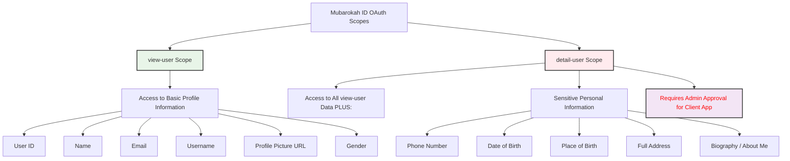

# Scopes and Permissions

Mubarokah ID uses OAuth 2.0 scopes to allow users to grant varying levels of access to their account data to client applications. When your application requests authorization, it must specify which scopes it needs. The user will see these requested scopes on the consent screen and can choose to approve or deny them.

## Available Scopes

Here are the primary scopes available through Mubarokah ID:

### Scope Hierarchy



### Scope Permission Matrix

| Scope         | Data Access Granted                                                                 | Approval Process for Client | Common Use Cases                                                                 | API Endpoints Covered                               |
|---------------|-------------------------------------------------------------------------------------|-----------------------------|----------------------------------------------------------------------------------|-----------------------------------------------------|
| `view-user`   | ✅ Basic profile attributes (ID, name, email, username, profile picture, gender).     | **Automatic** upon user consent. | • Displaying user's name/avatar. <br/> • Personalizing the user experience. <br/> • Basic account identification. | [`/api/user`](../api-reference/user/get-user-info)    |
| `detail-user` | ✅ All data from `view-user`. <br/> ✅ Sensitive personal info (phone, DOB, address, bio). | **Manual Admin Review** of your application is required. | • KYC (Know Your Customer) processes. <br/> • Address verification for services. <br/> • Contact information integration. | [`/api/user/details`](../api-reference/user/get-user-details) |

<Info>
Always request the minimum number of scopes necessary for your application's functionality. Requesting excessive scopes can lead to lower user consent rates.
</Info>

## Practical Implementation Examples

### 1. Basic OAuth Flow with `view-user` Scope

```javascript
// Step 1: Generate authorization URL
const generateAuthURL = () => {
  const authParams = new URLSearchParams({
    response_type: 'code',
    client_id: 'your_client_id',
    redirect_uri: 'https://yourapp.com/auth/callback',
    scope: 'view-user',
    state: generateRandomState()
  });
  
  return `https://mubarokah.id/oauth/authorize?${authParams}`;
};

// Step 2: Exchange authorization code for access token
const exchangeCodeForToken = async (authorizationCode) => {
  const response = await fetch('https://mubarokah.id/oauth/token', {
    method: 'POST',
    headers: {
      'Content-Type': 'application/x-www-form-urlencoded'
    },
    body: new URLSearchParams({
      grant_type: 'authorization_code',
      client_id: 'your_client_id',
      client_secret: 'your_client_secret',
      code: authorizationCode,
      redirect_uri: 'https://yourapp.com/auth/callback'
    })
  });
  
  return await response.json();
};

// Step 3: Fetch user information
const getUserInfo = async (accessToken) => {
  const response = await fetch('https://mubarokah.id/api/user', {
    headers: {
      'Authorization': `Bearer ${accessToken}`,
      'Accept': 'application/json'
    }
  });
  
  if (!response.ok) {
    throw new Error(`HTTP ${response.status}: ${response.statusText}`);
  }
  
  return await response.json();
};

// Complete workflow example
const handleOAuthCallback = async (code, state) => {
  try {
    // Validate state parameter (CSRF protection)
    if (!validateState(state)) {
      throw new Error('Invalid state parameter');
    }
    
    // Exchange code for tokens
    const tokenResponse = await exchangeCodeForToken(code);
    const { access_token, refresh_token } = tokenResponse;
    
    // Fetch user information
    const userInfo = await getUserInfo(access_token);
    
    console.log('User authenticated:', userInfo);
    
    // Store tokens securely (server-side only)
    await storeTokensSecurely(userInfo.id, access_token, refresh_token);
    
    return userInfo;
  } catch (error) {
    console.error('OAuth callback error:', error);
    throw error;
  }
};
```

### 2. Advanced Implementation with `detail-user` Scope

```javascript
// Enhanced authorization URL for detailed user information
const generateDetailedAuthURL = () => {
  const authParams = new URLSearchParams({
    response_type: 'code',
    client_id: 'your_approved_client_id',
    redirect_uri: 'https://yourapp.com/auth/callback',
    scope: 'view-user detail-user',
    state: generateRandomState(),
    prompt: 'consent' // Ensure user sees the consent screen
  });
  
  return `https://mubarokah.id/oauth/authorize?${authParams}`;
};

// Fetch detailed user information (requires admin approval)
const getUserDetails = async (accessToken) => {
  try {
    const response = await fetch('https://mubarokah.id/api/user/details', {
      headers: {
        'Authorization': `Bearer ${accessToken}`,
        'Accept': 'application/json'
      }
    });
    
    if (response.status === 403) {
      const error = await response.json();
      if (error.error === 'unapproved_scope') {
        throw new Error('Your application needs admin approval to access detailed user information. Please contact support.');
      }
      if (error.error === 'insufficient_scope') {
        throw new Error('Access token does not have the required detail-user scope.');
      }
    }
    
    if (!response.ok) {
      throw new Error(`HTTP ${response.status}: ${response.statusText}`);
    }
    
    return await response.json();
  } catch (error) {
    console.error('Failed to fetch user details:', error);
    throw error;
  }
};

// Complete user data aggregation
const getCompleteUserProfile = async (accessToken) => {
  try {
    // Always fetch basic info first
    const basicInfo = await getUserInfo(accessToken);
    
    let detailedInfo = null;
    try {
      // Attempt to fetch detailed info if approved
      detailedInfo = await getUserDetails(accessToken);
    } catch (error) {
      console.warn('Detailed user info not available:', error.message);
    }
    
    return {
      basic: basicInfo,
      detailed: detailedInfo,
      hasDetailedAccess: detailedInfo !== null
    };
  } catch (error) {
    console.error('Failed to get complete user profile:', error);
    throw error;
  }
};
```

### 3. Token Refresh Implementation

```javascript
// Refresh access token using refresh token
const refreshAccessToken = async (refreshToken) => {
  const response = await fetch('https://mubarokah.id/oauth/token', {
    method: 'POST',
    headers: {
      'Content-Type': 'application/x-www-form-urlencoded'
    },
    body: new URLSearchParams({
      grant_type: 'refresh_token',
      refresh_token: refreshToken,
      client_id: 'your_client_id',
      client_secret: 'your_client_secret'
    })
  });
  
  if (!response.ok) {
    throw new Error('Failed to refresh token');
  }
  
  return await response.json();
};

// API wrapper with automatic token refresh
class MubarokahAPIClient {
  constructor(accessToken, refreshToken) {
    this.accessToken = accessToken;
    this.refreshToken = refreshToken;
  }
  
  async makeAuthenticatedRequest(url, options = {}) {
    const requestOptions = {
      ...options,
      headers: {
        'Authorization': `Bearer ${this.accessToken}`,
        'Accept': 'application/json',
        ...options.headers
      }
    };
    
    let response = await fetch(url, requestOptions);
    
    // Handle token expiration
    if (response.status === 401) {
      try {
        const tokenResponse = await refreshAccessToken(this.refreshToken);
        this.accessToken = tokenResponse.access_token;
        
        // Retry the original request with new token
        requestOptions.headers['Authorization'] = `Bearer ${this.accessToken}`;
        response = await fetch(url, requestOptions);
      } catch (refreshError) {
        throw new Error('Token refresh failed. User needs to re-authenticate.');
      }
    }
    
    if (!response.ok) {
      throw new Error(`HTTP ${response.status}: ${response.statusText}`);
    }
    
    return await response.json();
  }
  
  async getUserInfo() {
    return this.makeAuthenticatedRequest('https://mubarokah.id/api/user');
  }
  
  async getUserDetails() {
    return this.makeAuthenticatedRequest('https://mubarokah.id/api/user/details');
  }
}
```

## `detail-user` Scope Approval Process

The `detail-user` scope provides access to sensitive personal information. Due to the sensitive nature of this data, applications requesting this scope must undergo an administrative approval process.

### Approval Requirements

<Steps>
  <Step title="Application Registration">
    Your application must first be registered with Mubarokah ID and have basic OAuth integration working with the `view-user` scope.
  </Step>
  
  <Step title="Documentation Submission">
    Submit the following documentation:
    - **Privacy Policy**: Clear statement on how user data will be handled
    - **Data Usage Justification**: Detailed explanation of why detailed user information is needed
    - **Security Measures**: Description of data protection measures in your application
    - **Compliance Information**: Evidence of GDPR, CCPA, or local data protection compliance
  </Step>
  
  <Step title="Technical Review">
    Your application will undergo a security review including:
    - Code review of OAuth implementation
    - Security audit of data handling procedures
    - Testing of data deletion capabilities
  </Step>
  
  <Step title="Approval Decision">
    If approved, your application can successfully request the `detail-user` scope during OAuth flows.
    If rejected, reasons will be provided with guidance for resubmission.
  </Step>
</Steps>

<Warning>
**Important**: Even after obtaining the `detail-user` scope in an access token, your application will receive a `403 Forbidden` error when calling `/api/user/details` unless your client application has received administrative approval.
</Warning>

### Approval Process Implementation

```javascript
// Check if client application has approval for detail-user scope
const checkScopeApproval = async (clientId) => {
  try {
    const response = await fetch(`https://mubarokah.id/api/admin/scope-approval/${clientId}`, {
      headers: {
        'Authorization': `Bearer ${adminToken}`,
        'Accept': 'application/json'
      }
    });
    
    if (response.ok) {
      const approval = await response.json();
      return approval.scopes.includes('detail-user');
    }
    
    return false;
  } catch (error) {
    console.error('Failed to check scope approval:', error);
    return false;
  }
};

// Graceful handling of unapproved scope requests
const safeGetUserDetails = async (accessToken) => {
  try {
    return await getUserDetails(accessToken);
  } catch (error) {
    if (error.message.includes('unapproved_scope')) {
      // Handle gracefully - maybe show an upgrade message to admin
      return {
        error: 'approval_required',
        message: 'This feature requires additional permissions. Please contact your administrator to request approval for detailed user access.',
        upgradeAction: 'request_approval'
      };
    }
    throw error;
  }
};
```

## Compliance and Legal Considerations

Handling user data, especially sensitive information accessible via the `detail-user` scope, comes with significant responsibilities.

### Data Usage Guidelines

<Tabs>
  <Tab title="🔒 Data Minimization">
    ```javascript
    // Good: Only request scopes you actively use
    const authURL = generateAuthURL(['view-user']); // Basic profile only
    
    // Avoid: Requesting excessive scopes
    const authURL = generateAuthURL(['view-user', 'detail-user']); // Only if truly needed
    ```
  </Tab>
  
  <Tab title="📝 Purpose Limitation">
    ```javascript
    // Good: Clear purpose-specific data usage
    class UserProfileService {
      async getProfileForDisplay(accessToken) {
        const basicInfo = await getUserInfo(accessToken);
        return {
          displayName: basicInfo.name,
          avatar: basicInfo.profile_picture,
          username: basicInfo.username
        };
      }
      
      async getProfileForKYC(accessToken) {
        // Only call if explicitly needed for KYC
        const detailedInfo = await getUserDetails(accessToken);
        return {
          fullName: detailedInfo.name,
          dateOfBirth: detailedInfo.date_of_birth,
          address: detailedInfo.address
        };
      }
    }
    ```
  </Tab>
  
  <Tab title="🛡️ Data Security">
    ```javascript
    // Implementation with encryption and secure storage
    class SecureUserDataManager {
      constructor(encryptionKey) {
        this.encryptionKey = encryptionKey;
      }
      
      async storeUserData(userId, userData) {
        const encryptedData = await this.encrypt(userData);
        
        // Store with automatic expiration
        await this.secureStorage.set(`user:${userId}`, encryptedData, {
          ttl: 24 * 60 * 60 * 1000, // 24 hours
          encrypted: true
        });
      }
      
      async getUserData(userId) {
        const encryptedData = await this.secureStorage.get(`user:${userId}`);
        return encryptedData ? await this.decrypt(encryptedData) : null;
      }
      
      async deleteUserData(userId) {
        await this.secureStorage.delete(`user:${userId}`);
        // Also clear from any caches
        await this.clearUserFromCaches(userId);
      }
    }
    ```
  </Tab>
  
  <Tab title="🗑️ Data Retention">
    ```javascript
    // Automatic data cleanup implementation
    class DataRetentionManager {
      constructor() {
        this.retentionPeriods = {
          basic_profile: 365 * 24 * 60 * 60 * 1000, // 1 year
          detailed_profile: 90 * 24 * 60 * 60 * 1000, // 90 days
          access_logs: 180 * 24 * 60 * 60 * 1000 // 6 months
        };
      }
      
      async scheduleDataCleanup(userId, dataType) {
        const retentionPeriod = this.retentionPeriods[dataType];
        const expiryDate = new Date(Date.now() + retentionPeriod);
        
        await this.scheduler.schedule('cleanup_user_data', {
          userId,
          dataType,
          executeAt: expiryDate
        });
      }
      
      async handleUserAccountDeletion(userId) {
        // Immediate deletion of all user data
        await Promise.all([
          this.deleteUserProfile(userId),
          this.deleteUserAccessLogs(userId),
          this.deleteUserFromThirdPartyServices(userId),
          this.cancelScheduledCleanups(userId)
        ]);
      }
    }
    ```
  </Tab>
</Tabs>

### Privacy Compliance Implementation

```javascript
// GDPR/Privacy compliance helper
class PrivacyComplianceManager {
  async handleDataSubjectRequest(userId, requestType) {
    switch (requestType) {
      case 'access':
        return this.exportUserData(userId);
      
      case 'rectification':
        return this.updateUserData(userId);
      
      case 'erasure':
        return this.deleteUserData(userId);
      
      case 'portability':
        return this.exportPortableUserData(userId);
      
      case 'restriction':
        return this.restrictUserDataProcessing(userId);
      
      default:
        throw new Error('Unsupported data subject request type');
    }
  }
  
  async exportUserData(userId) {
    const userData = await this.getUserCompleteProfile(userId);
    const accessLogs = await this.getUserAccessLogs(userId);
    
    return {
      profile: userData,
      access_history: accessLogs,
      data_retention_info: this.getRetentionInfo(userId),
      export_date: new Date().toISOString()
    };
  }
  
  async auditDataAccess(userId, accessType, purpose) {
    await this.auditLogger.log({
      user_id: userId,
      access_type: accessType,
      purpose: purpose,
      timestamp: new Date(),
      ip_address: this.getCurrentIPAddress(),
      user_agent: this.getCurrentUserAgent()
    });
  }
}
```

## Error Handling Best Practices

```javascript
// Comprehensive error handling for OAuth and API calls
class MubarokahErrorHandler {
  static handleOAuthError(error) {
    const errorMappings = {
      'invalid_request': 'The request is missing required parameters or contains invalid values.',
      'invalid_client': 'Client authentication failed or client is not authorized.',
      'invalid_grant': 'The authorization code is invalid, expired, or revoked.',
      'unauthorized_client': 'The client is not authorized to use this authorization grant type.',
      'unsupported_grant_type': 'The grant type is not supported by the authorization server.',
      'invalid_scope': 'The requested scope is invalid, unknown, or malformed.',
      'access_denied': 'The user denied the authorization request.',
      'unapproved_scope': 'Your application needs admin approval to access this data.'
    };
    
    return {
      code: error.error || 'unknown_error',
      message: errorMappings[error.error] || error.error_description || 'An unknown error occurred',
      userMessage: this.getUserFriendlyMessage(error.error)
    };
  }
  
  static getUserFriendlyMessage(errorCode) {
    const userMessages = {
      'access_denied': 'You declined to authorize this application. Please try again if you want to proceed.',
      'invalid_scope': 'This application is requesting permissions that are not available.',
      'unapproved_scope': 'This feature requires additional approval. Please contact support.',
      'token_expired': 'Your session has expired. Please log in again.',
      'insufficient_scope': 'You need to grant additional permissions to use this feature.'
    };
    
    return userMessages[errorCode] || 'An error occurred during authentication. Please try again.';
  }
}

// Usage example with proper error handling
const handleUserAuthentication = async (authCode) => {
  try {
    const tokens = await exchangeCodeForToken(authCode);
    const userProfile = await getCompleteUserProfile(tokens.access_token);
    
    return {
      success: true,
      user: userProfile,
      tokens: tokens
    };
  } catch (error) {
    const handledError = MubarokahErrorHandler.handleOAuthError(error);
    
    console.error('Authentication error:', handledError);
    
    return {
      success: false,
      error: handledError,
      retryable: ['token_expired', 'access_denied'].includes(handledError.code)
    };
  }
};
```

<Note>
This implementation provides production-ready code examples that can be directly used and tested with the Mubarokah ID OAuth system. All endpoints use the correct `https://mubarokah.id/` domain and include proper error handling, security measures, and compliance considerations.
</Note>
```