# Scopes and Permissions

Mubarokah ID uses OAuth 2.0 scopes to allow users to grant varying levels of access to their account data to client applications. When your application requests authorization, it must specify which scopes it needs. The user will see these requested scopes on the consent screen and can choose to approve or deny them.

## Available Scopes

Here are the primary scopes available through Mubarokah ID:

### Scope Hierarchy

```mermaid
graph TD
    A[Mubarokah ID OAuth Scopes] --> B[\`view-user\` Scope]
    A --> C[\`detail-user\` Scope]

    B --> B1[Access to Basic Profile Information]
    B1 --> B2[User ID]
    B1 --> B3[Name]
    B1 --> B4[Email]
    B1 --> B5[Username]
    B1 --> B6[Profile Picture URL]
    B1 --> B7[Gender]

    C --> C1[Access to All \`view-user\` Data PLUS:]
    C --> C2[Sensitive Personal Information]
    C2 --> C3[Phone Number]
    C2 --> C4[Date of Birth]
    C2 --> C5[Place of Birth]
    C2 --> C6[Full Address]
    C2 --> C7[Biography / About Me]

    C --> C8[<font color=red>Requires Admin Approval for Client App</font>]

    style B fill:#e8f5e8,stroke:#333,stroke-width:2px
    style C fill:#ffebee,stroke:#333,stroke-width:2px
    style C8 fill:#f3e5f5,stroke:#333,stroke-width:2px,color:red
```

### Scope Permission Matrix

| Scope         | Data Access Granted                                                                 | Approval Process for Client | Common Use Cases                                                                 | API Endpoints Covered                               |
|---------------|-------------------------------------------------------------------------------------|-----------------------------|----------------------------------------------------------------------------------|-----------------------------------------------------|
| `view-user`   | ✅ Basic profile attributes (ID, name, email, username, profile picture, gender).     | **Automatic** upon user consent. | • Displaying user's name/avatar. <br/> • Personalizing the user experience. <br/> • Basic account identification. | [`/api/user`](../api-reference/user/get-user-info)    |
| `detail-user` | ✅ All data from `view-user`. <br/> ✅ Sensitive personal info (phone, DOB, address, bio). | **Manual Admin Review** of your application is required. | • KYC (Know Your Customer) processes. <br/> • Address verification for services. <br/> • Contact information integration. | [`/api/user/details`](../api-reference/user/get-user-details) |

<Info>
Always request the minimum number of scopes necessary for your application's functionality. Requesting excessive scopes can lead to lower user consent rates.
</Info>

## `detail-user` Scope Approval Process

The `detail-user` scope provides access to sensitive personal information. To protect user privacy and ensure responsible data handling, client applications wishing to use this scope must undergo an administrative approval process.

### Overview of Approval

```mermaid
sequenceDiagram
    participant Dev as 👨‍💻 Developer (Your App)
    participant Portal as 🌐 Mubarokah ID Developer Portal
    participant AdminTeam as 👨‍💼 Mubarokah ID Admin Team
    participant User as 👤 End User

    Dev->>+Portal: 1. Submits 'detail-user' scope request for their application.
    Note over Dev,Portal: Includes purpose justification & required documentation.
    Portal->>-Dev: 2. Confirms submission.
    Portal->>AdminTeam: 3. Notifies Admin Team of new request.

    AdminTeam->>AdminTeam: 4. Reviews application details, justification, and documents.
    alt Request Approved
        AdminTeam->>+Portal: 5a. Approves 'detail-user' scope for the client_id.
        Portal->>-AdminTeam: 6a. Records approval.
        Portal->>Dev: 7a. Notifies Developer of approval.
        Note over Dev: App can now successfully request 'detail-user' scope.
        Dev->>User: 8a. User sees 'detail-user' in consent screen & can grant.
    else Request Rejected
        AdminTeam->>+Portal: 5b. Rejects 'detail-user' scope with reasons.
        Portal->>-AdminTeam: 6b. Records rejection.
        Portal->>Dev: 7b. Notifies Developer of rejection and reasons.
        Note over Dev: App cannot use 'detail-user' scope.
    end
```



### Step-by-Step Approval Guide

#### Step 1: Submit Request via Developer Portal

1.  Log in to the Mubarokah ID Developer Portal (e.g., `https://sso.mubarokahid.com/developer/applications`).
2.  Select your application.
3.  Navigate to the "Scopes" or "Permissions" section.
4.  Find the `detail-user` scope and click "Request Approval."
    ```javascript
    // Illustrative: How to navigate to the scope request portal (actual URL may vary)
    // const requestDetailUserScope = (clientId) => {
    //   const portalUrl = \`https://sso.mubarokahid.com/developer/applications/\${clientId}/scopes/request\`;
    //   window.open(portalUrl, '_blank');
    // };
    ```

#### Step 2: Provide Required Information

You will be asked to provide:
-   **Client ID**: Your application's client ID.
-   **Entity Type**: Whether you are an individual developer, organization, or company.
-   **Contact Information**: Name, phone, email of the person responsible.
-   **Application URL**: Link to your live application or test environment.
-   **Purpose Justification**: A detailed explanation of why your application needs access to detailed user information and how this data will be used and protected.
-   **Data Handling Policies**: Links to your application's privacy policy and terms of service.

#### Step 3: Upload Required Documentation

Documentation requirements vary based on entity type:

-   **Individual Developers**:
    -   ✅ KTP (Indonesian ID Card) or equivalent national ID for identity verification.
    -   ✅ Business License (if applicable, e.g., for sole proprietorships).
-   **Organizations/Companies**:
    -   ✅ NIB (Nomor Induk Berusaha - Business Registration Number for Indonesia).
    -   ✅ NPWP (Nomor Pokok Wajib Pajak - Taxpayer Identification Number for Indonesia).
    -   ✅ Akta Pendirian Perusahaan (Deed of Establishment).
    -   ✅ Company Profile.

<Warning>Ensure all documents are clear, valid, and legible. Incomplete or unclear documentation can delay the approval process.</Warning>

#### Step 4: Admin Review Process

-   The Mubarokah ID Admin Team will review your request, justification, and documents.
-   This process may take several business days.
-   You may be contacted for additional information or clarification.
    ```php
    // Simplified internal admin workflow (conceptual)
    // class ScopeAccessRequestController
    // {
    //     public function approve(ScopeAccessRequest $request)
    //     {
    //         DB::transaction(function() use ($request) {
    //             $request->update([
    //                 'status' => 'approved',
    //                 'approved_by' => Auth::id(), // Admin user
    //                 'approved_at' => now()
    //             ]);
    //
    //             // System flag enabling the scope for the client_id
    //             ClientScopeApproval::enable($request->client_id, 'detail-user');
    //
    //             // Notify developer via email/portal
    //             $request->developer->notify(new ScopeRequestApprovedNotification($request));
    //         });
    //     }
    // }
    ```

#### Step 5: Notification and Implementation

-   You will be notified via email and/or the Developer Portal once a decision is made.
-   If **approved**, your application can now successfully request the `detail-user` scope during the OAuth flow, and users will be able to consent to it.
-   If **rejected**, reasons will be provided. You may need to address the concerns and re-apply.

Once approved, when you include `detail-user` in the `scope` parameter of your authorization request, users will see this permission on the consent screen. If they grant it, the resulting access token will be authorized to call the [`/api/user/details`](../api-reference/user/get-user-details) endpoint.

## Compliance and Legal Considerations

Handling user data, especially sensitive information accessible via the `detail-user` scope, comes with significant responsibilities.

### Data Usage Guidelines:

-   🔒 **Principle of Least Privilege**: Only request scopes that are absolutely necessary for your application's functionality.
-   📝 **Purpose Limitation**: Use the data obtained only for the purposes clearly stated to the user and for which they provided consent. Do not repurpose data without additional consent.
-   🛡️ **Data Minimization**: Do not request or store data you do not need.
-   🗑️ **Data Retention**: Establish clear data retention policies. Delete user data that is no longer necessary for the stated purpose or when a user revokes access or deletes their account with your service.
-   🔐 **Security Standards**: Implement robust security measures to protect user data, including encryption at rest and in transit, access controls, and regular security audits.
-   📊 **Audit Trails**: Maintain logs of data access, especially for sensitive information.

### Privacy Compliance:

-   **Transparency**: Clearly inform users how their data will be used, stored, and protected in your privacy policy.
-   **User Consent**: Ensure you have explicit user consent for any data processing activities. The OAuth consent screen is part of this, but your application's own terms and privacy policy are also crucial.
-   **User Rights**: Provide mechanisms for users to exercise their data rights (e.g., access, correction, deletion) as required by applicable privacy laws (like GDPR, CCPA, or local Indonesian regulations).
-   **Data Processing Agreements**: If Mubarokah ID acts as a data processor on your behalf, or vice-versa, ensure appropriate agreements are in place.

```javascript
// Example: Privacy-compliant data handling class structure (conceptual)
// class UserDataManager {
//   constructor(apiAccessToken, encryptionKey) {
//     this.apiAccessToken = apiAccessToken;
//     this.encryptionKey = encryptionKey; // For client-side encryption if needed
//   }

//   async fetchAndStoreUserData(userId, requestedScopes) {
//     // 1. Fetch only data corresponding to granted scopes
//     const userData = await this.fetchUserDataFromApi(this.apiAccessToken, requestedScopes);

//     // 2. Encrypt sensitive fields before storage (if storing)
//     const encryptedData = this.encryptSensitiveFields(userData, ['phone_number', 'address']);

//     // 3. Store with clear purpose and retention policy
//     await database.saveUserRecord(userId, encryptedData, {
//       purpose: "To provide personalized services as per user consent.",
//       retention: "Delete after 30 days of inactivity or upon user request."
//     });

//     // 4. Log access for audit purposes
//     this.logDataAccess(userId, 'fetch_and_store_user_data', requestedScopes);

//     return userData;
//   }

//   async deleteUserData(userId) {
//     // Implement secure deletion from your systems
//     await database.deleteUserRecord(userId);
//     this.logDataAccess(userId, 'delete_user_data', ['all_data']);
//   }

//   // ... other methods for encryption, logging, etc.
// }
```
<Warning>
Failure to comply with data protection regulations and Mubarokah ID's terms of service regarding data handling can result in revocation of API access and other penalties.
</Warning>
