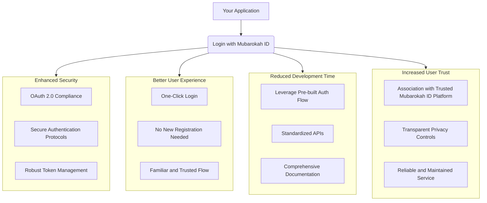

# What is "Login with Mubarokah ID"?

"Login with Mubarokah ID" is an **OAuth 2.0 authentication service** that allows users to log in to your application using their Mubarokah ID accounts, similar to "Login with Google" or "Login with Facebook". It provides a secure and seamless way for users to access your services without needing to create a new set of credentials.

## 🔥 Core Features

- **🔐 Secure OAuth 2.0**: Full compliance with [RFC 6749](https://tools.ietf.org/html/rfc6749), ensuring industry-standard security.
- **👤 User Authentication**: Provides a seamless and familiar login experience for users.
- **🎯 Granular Permissions**: Scope-based access control allows users to grant specific permissions to your application.
- **🚀 Easy Integration**: Built on standard OAuth 2.0 protocols, making it developer-friendly to integrate.
- **🛡️ Enterprise Security**: Supports advanced security mechanisms like PKCE (Proof Key for Code Exchange), CSRF protection, and secure token management.
- **📱 Universal Compatibility**: Designed to work with web, mobile, and desktop applications.

## 🎨 Integration Benefits

Integrating "Login with Mubarokah ID" offers several advantages for your application and users:

## 🌟 Why Choose Login with Mubarokah ID?

- **🎯 Faster User Onboarding**: Users can instantly log in or sign up using their existing Mubarokah ID, reducing friction.
- **🔒 Enhanced Security**: Leverage the advanced security infrastructure and practices of the Mubarokah ID platform.
- **📊 User Data Access**: Access user profile information (with explicit user consent) to personalize their experience.
- **⚡ Quick Implementation**: Adherence to OAuth 2.0 standards makes integration straightforward for developers.
- **🛡️ Privacy Compliant**: Built-in privacy controls and user consent mechanisms help you meet data privacy requirements.
