```mermaid
graph LR
    A[📁 app/] --> B[📁 models/]
    A --> C[📁 services/]
    A --> D[📁 core/]
    A --> E[📁 routers/]
    A --> F[📄 main.py]
    
    ROOT[📁 Project Root] --> A
    ROOT --> G[📄 .env]
    
    B --> B1[📄 oauth.py<br/>🔧 OAuth data models<br/>& schemas]
    
    C --> C1[📄 oauth_service.py<br/>🔐 OAuth business logic<br/>& API integration]
    C --> C2[📄 token_service.py<br/>🗝️ Token management<br/>& validation]
    
    D --> D1[📄 config.py<br/>⚙️ Application settings<br/>& configuration]
    D --> D2[📄 security.py<br/>🛡️ Security utilities<br/>& auth helpers]
    
    E --> E1[📄 auth.py<br/>🔗 Authentication routes<br/>& endpoints]
    
    F --> F_DESC[🚀 FastAPI application<br/>entry point]
    G --> G_DESC[🔒 Environment variables<br/>& secrets]
    
    classDef folder fill:#e8f5e8,stroke:#2e7d32,stroke-width:2px
    classDef file fill:#fff3e0,stroke:#f57c00,stroke-width:2px
    classDef main fill:#e3f2fd,stroke:#1976d2,stroke-width:3px
    classDef env fill:#fce4ec,stroke:#c2185b,stroke-width:2px
    
    class ROOT,A,B,C,D,E folder
    class B1,C1,C2,D1,D2,E1 file
    class F,F_DESC main
    class G,G_DESC env
```

# Python (FastAPI) Integration Guide

This guide provides an asynchronous implementation example for integrating Mubarokah ID OAuth 2.0 into a Python application using the FastAPI framework. It covers Pydantic models for data validation, an OAuth service for interacting with Mubarokah ID, token management, and example API endpoints.

## Prerequisites

-   Python 3.7+
-   FastAPI: `pip install fastapi uvicorn`
-   HTTPX for async HTTP requests: `pip install httpx`
-   Pydantic for data validation (comes with FastAPI).
-   Optional: `redis` for token storage: `pip install redis`
-   Optional: `cryptography` for encrypting tokens at rest: `pip install cryptography`

## Project Structure (Conceptual)



## Configuration (`core/config.py`)

```python
from pydantic_settings import BaseSettings
from functools import lru_cache

class Settings(BaseSettings):
    MUBAROKAH_CLIENT_ID: str
    MUBAROKAH_CLIENT_SECRET: str
    MUBAROKAH_REDIRECT_URI: str
    MUBAROKAH_BASE_URL: str = "https://mubarokah.id"
    REDIS_URL: str = "redis://localhost:6379/0"
    TOKEN_ENCRYPTION_KEY: str = "your_fernet_encryption_key_here"
    APP_SECRET_KEY: str = "your_strong_application_secret_key"

    class Config:
        env_file = ".env"
        env_file_encoding = 'utf-8'

@lru_cache()
def get_settings():
    return Settings()

settings = get_settings()
```
**`.env` file example:**
```env
MUBAROKAH_CLIENT_ID="your_fastapi_client_id"
MUBAROKAH_CLIENT_SECRET="your_fastapi_client_secret"
MUBAROKAH_REDIRECT_URI="http://localhost:8000/auth/mubarokah/callback"
MUBAROKAH_BASE_URL="https://mubarokah.id"
REDIS_URL="redis://localhost:6379/0"
TOKEN_ENCRYPTION_KEY="your_generated_fernet_key"
APP_SECRET_KEY="a_very_secure_and_random_string_for_sessions"
```

## Pydantic Models (`models/oauth.py`)

```python
from pydantic import BaseModel, HttpUrl
from typing import Optional, List
from datetime import datetime

class TokenResponse(BaseModel):
    token_type: str = "Bearer"
    expires_in: int
    access_token: str
    refresh_token: Optional[str] = None
    scope: Optional[str] = None

class UserInfo(BaseModel):
    id: int | str
    name: str
    email: str
    profile_picture: Optional[HttpUrl] = None
    username: str
    gender: Optional[str] = None

class DetailedUserInfo(UserInfo):
    bio: Optional[str] = None
    phone_number: Optional[str] = None
    place_of_birth: Optional[str] = None
    date_of_birth: Optional[str] = None
    address: Optional[str] = None

class StoredTokenData(BaseModel):
    user_mubarokah_id: str
    access_token: str # Encrypted
    refresh_token: Optional[str] = None # Encrypted
    expires_at: datetime
    scopes: Optional[List[str]] = None
    user_info_cache: Optional[UserInfo] = None
```

## Mubarokah OAuth Service (`services/oauth_service.py`)

```python
import httpx
import secrets
import hashlib
import base64
from urllib.parse import urlencode
from typing import Optional, List, Dict, Any

from app.models.oauth import TokenResponse, UserInfo, DetailedUserInfo
from app.core.config import settings

class MubarokahOAuthService:
    def __init__(self, http_client: httpx.AsyncClient):
        self.http_client = http_client
        self.client_id = settings.MUBAROKAH_CLIENT_ID
        self.client_secret = settings.MUBAROKAH_CLIENT_SECRET
        self.redirect_uri = settings.MUBAROKAH_REDIRECT_URI
        self.base_url = settings.MUBAROKAH_BASE_URL.rstrip('/')

    def _generate_pkce(self) -> tuple[str, str]:
        code_verifier = secrets.token_urlsafe(64)[:128]
        code_challenge_bytes = hashlib.sha256(code_verifier.encode('utf-8')).digest()
        code_challenge_b64 = base64.urlsafe_b64encode(code_challenge_bytes).decode('utf-8').rstrip('=')
        return code_verifier, code_challenge_b64

    def get_authorization_url(
        self,
        scopes: Optional[List[str]] = None,
        use_pkce: bool = True
    ) -> Dict[str, str]:
        state = secrets.token_urlsafe(32)
        actual_scopes = scopes or ["view-user"]
        params: Dict[str, Any] = {
            "response_type": "code",
            "client_id": self.client_id,
            "redirect_uri": self.redirect_uri,
            "scope": " ".join(actual_scopes),
            "state": state,
        }
        result: Dict[str, str] = {"state": state}
        if use_pkce:
            code_verifier, code_challenge = self._generate_pkce()
            params["code_challenge"] = code_challenge
            params["code_challenge_method"] = "S256"
            result["code_verifier"] = code_verifier
        result["url"] = f"{self.base_url}/oauth/authorize?{urlencode(params)}"
        return result

    async def exchange_code_for_tokens(
        self, code: str, code_verifier: Optional[str] = None
    ) -> TokenResponse:
        payload: Dict[str, Any] = {
            "grant_type": "authorization_code",
            "client_id": self.client_id,
            "client_secret": self.client_secret,
            "redirect_uri": self.redirect_uri,
            "code": code,
        }
        if code_verifier:
            payload["code_verifier"] = code_verifier
        response = await self.http_client.post(
            f"{self.base_url}/oauth/token",
            data=payload,
            headers={"Content-Type": "application/x-www-form-urlencoded"}
        )
        response.raise_for_status()
        return TokenResponse(**response.json())

    async def refresh_access_token(self, refresh_token_value: str) -> TokenResponse:
        payload: Dict[str, Any] = {
            "grant_type": "refresh_token",
            "refresh_token": refresh_token_value,
            "client_id": self.client_id,
            "client_secret": self.client_secret,
        }
        response = await self.http_client.post(
            f"{self.base_url}/oauth/token",
            data=payload,
            headers={"Content-Type": "application/x-www-form-urlencoded"}
        )
        response.raise_for_status()
        return TokenResponse(**response.json())

    async def get_user_info(self, access_token: str) -> UserInfo:
        response = await self.http_client.get(
            f"{self.base_url}/api/user",
            headers={"Authorization": f"Bearer {access_token}", "Accept": "application/json"}
        )
        response.raise_for_status()
        return UserInfo(**response.json())

    async def get_detailed_user_info(self, access_token: str) -> DetailedUserInfo:
        response = await self.http_client.get(
            f"{self.base_url}/api/user/details",
            headers={"Authorization": f"Bearer {access_token}", "Accept": "application/json"}
        )
        response.raise_for_status()
        return DetailedUserInfo(**response.json())

async def get_oauth_service():
    async with httpx.AsyncClient() as client:
        yield MubarokahOAuthService(client)
```

## Token Service (`services/token_service.py`)

```python
import redis.asyncio as redis
from datetime import datetime, timedelta, timezone
from typing import Optional, List
from cryptography.fernet import Fernet

from app.core.config import settings
from app.models.oauth import StoredTokenData, TokenResponse, UserInfo

class TokenService:
    def __init__(self):
        self.redis_client = redis.from_url(settings.REDIS_URL, decode_responses=True)
        self.cipher = Fernet(settings.TOKEN_ENCRYPTION_KEY.encode())

    def _encrypt(self, data: str) -> str:
        return self.cipher.encrypt(data.encode()).decode()

    def _decrypt(self, encrypted_data: str) -> str:
        return self.cipher.decrypt(encrypted_data.encode()).decode()

    async def store_tokens(
        self,
        user_mubarokah_id: str,
        tokens: TokenResponse,
        user_info: Optional[UserInfo] = None
    ) -> None:
        expires_at = datetime.now(timezone.utc) + timedelta(seconds=tokens.expires_in)
        stored_token_data = StoredTokenData(
            user_mubarokah_id=str(user_mubarokah_id),
            access_token=self._encrypt(tokens.access_token),
            refresh_token=self._encrypt(tokens.refresh_token) if tokens.refresh_token else None,
            expires_at=expires_at,
            scopes=tokens.scope.split(' ') if tokens.scope else None,
            user_info_cache=user_info
        )
        refresh_token_lifetime_seconds = 30 * 24 * 60 * 60
        await self.redis_client.set(
            f"mubarokah_token:{user_mubarokah_id}",
            stored_token_data.model_dump_json(),
            ex=refresh_token_lifetime_seconds
        )

    async def get_valid_tokens_by_user_id(self, user_mubarokah_id: str) -> Optional[StoredTokenData]:
        raw_data = await self.redis_client.get(f"mubarokah_token:{user_mubarokah_id}")
        if not raw_data:
            return None
        stored_data = StoredTokenData.model_validate_json(raw_data)
        stored_data.access_token = self._decrypt(stored_data.access_token)
        if stored_data.refresh_token:
            stored_data.refresh_token = self._decrypt(stored_data.refresh_token)
        return stored_data

    async def delete_tokens(self, user_mubarokah_id: str) -> None:
        await self.redis_client.delete(f"mubarokah_token:{user_mubarokah_id}")

async def get_token_service():
    service = TokenService()
    try:
        yield service
    finally:
        await service.redis_client.aclose()
```
<Warning>The `TokenService` uses Redis and Fernet encryption. Ensure Redis is running and `TOKEN_ENCRYPTION_KEY` is securely generated and stored.</Warning>

## Security Utilities (`core/security.py`)

```python
from fastapi import Depends, HTTPException, status, Request
from datetime import datetime, timezone, timedelta
import httpx

from app.models.oauth import UserInfo
from app.services.token_service import TokenService, get_token_service
from app.services.oauth_service import MubarokahOAuthService, get_oauth_service

async def get_current_user(
    request: Request,
    token_service: TokenService = Depends(get_token_service),
    oauth_service: MubarokahOAuthService = Depends(get_oauth_service)
) -> UserInfo:
    user_mubarokah_id = request.session.get("user_mubarokah_id")
    if not user_mubarokah_id:
        raise HTTPException(
            status_code=status.HTTP_401_UNAUTHORIZED,
            detail="Not authenticated (no session)",
            headers={"WWW-Authenticate": "Bearer"},
        )

    stored_tokens = await token_service.get_valid_tokens_by_user_id(user_mubarokah_id)
    if not stored_tokens:
        request.session.clear()
        raise HTTPException(status_code=status.HTTP_401_UNAUTHORIZED, detail="No valid tokens found. Please log in again.")

    if stored_tokens.expires_at < datetime.now(timezone.utc) + timedelta(minutes=5): # Buffer
        if stored_tokens.refresh_token:
            try:
                new_tokens = await oauth_service.refresh_access_token(stored_tokens.refresh_token)
                updated_user_info = await oauth_service.get_user_info(new_tokens.access_token)
                await token_service.store_tokens(user_mubarokah_id, new_tokens, updated_user_info)
                request.session["access_token"] = new_tokens.access_token
                return updated_user_info
            except httpx.HTTPStatusError as e:
                await token_service.delete_tokens(user_mubarokah_id)
                request.session.clear()
                error_detail = f"Session expired, token refresh failed: {e.response.text if e.response else str(e)}"
                raise HTTPException(status_code=status.HTTP_401_UNAUTHORIZED, detail=error_detail)
        else:
            await token_service.delete_tokens(user_mubarokah_id)
            request.session.clear()
            raise HTTPException(status_code=status.HTTP_401_UNAUTHORIZED, detail="Session expired, no refresh token.")

    if stored_tokens.user_info_cache:
        return stored_tokens.user_info_cache
    return await oauth_service.get_user_info(stored_tokens.access_token)

async def get_current_active_user(current_user: UserInfo = Depends(get_current_user)) -> UserInfo:
    return current_user
```

## Auth Routes (`routers/auth.py`)

```python
from fastapi import APIRouter, Depends, HTTPException, Request, status
from fastapi.responses import RedirectResponse
from typing import Optional
import httpx

from app.services.oauth_service import MubarokahOAuthService, get_oauth_service
from app.services.token_service import TokenService, get_token_service
from app.core.security import get_current_active_user
from app.models.oauth import UserInfo

router = APIRouter(prefix="/auth/mubarokah", tags=["Authentication"])

@router.get("/login")
async def login_with_mubarokah(
    request: Request,
    oauth_service: MubarokahOAuthService = Depends(get_oauth_service)
):
    auth_data = oauth_service.get_authorization_url(scopes=["view-user", "detail-user"])
    request.session["oauth_state"] = auth_data["state"]
    if "code_verifier" in auth_data:
        request.session["oauth_code_verifier"] = auth_data["code_verifier"]
    return RedirectResponse(url=auth_data["url"], status_code=status.HTTP_307_TEMPORARY_REDIRECT)

@router.get("/callback")
async def mubarokah_callback(
    request: Request,
    code: Optional[str] = None,
    state: Optional[str] = None,
    error: Optional[str] = None,
    error_description: Optional[str] = None,
    oauth_service: MubarokahOAuthService = Depends(get_oauth_service),
    token_service: TokenService = Depends(get_token_service)
):
    if error:
        raise HTTPException(status_code=status.HTTP_400_BAD_REQUEST, detail=f"OAuth Error: {error} - {error_description or 'Unknown error.'}")
    session_state = request.session.pop("oauth_state", None)
    if not session_state or session_state != state:
        raise HTTPException(status_code=status.HTTP_400_BAD_REQUEST, detail="Invalid state. CSRF suspected.")
    if not code:
        raise HTTPException(status_code=status.HTTP_400_BAD_REQUEST, detail="Authorization code missing.")
    code_verifier = request.session.pop("oauth_code_verifier", None)
    try:
        tokens = await oauth_service.exchange_code_for_tokens(code, code_verifier)
        user_info = await oauth_service.get_user_info(tokens.access_token)
        await token_service.store_tokens(str(user_info.id), tokens, user_info)
        request.session["user_mubarokah_id"] = str(user_info.id)
        request.session["access_token"] = tokens.access_token
        return RedirectResponse(url="/dashboard", status_code=status.HTTP_307_TEMPORARY_REDIRECT)
    except httpx.HTTPStatusError as e:
        error_detail = f"Token exchange/user info error: {e.response.text if e.response else str(e)}"
        raise HTTPException(status_code=status.HTTP_500_INTERNAL_SERVER_ERROR, detail=error_detail)
    except Exception as e:
        raise HTTPException(status_code=status.HTTP_500_INTERNAL_SERVER_ERROR, detail=f"Unexpected error: {str(e)}")

@router.post("/logout")
async def logout(request: Request, token_service: TokenService = Depends(get_token_service)):
    user_mubarokah_id = request.session.pop("user_mubarokah_id", None)
    request.session.pop("access_token", None)
    if user_mubarokah_id:
        await token_service.delete_tokens(user_mubarokah_id)
    request.session.clear()
    return {"message": "Successfully logged out"}

@router.get("/me", response_model=UserInfo)
async def read_users_me(current_user: UserInfo = Depends(get_current_active_user)):
    return current_user
```

## Main Application Setup (`main.py`)

```python
from fastapi import FastAPI, Request
from fastapi.responses import HTMLResponse, RedirectResponse
from starlette.middleware.sessions import SessionMiddleware
from starlette import status

from app.routers import auth as auth_router
from app.core.config import settings

app = FastAPI(title="Mubarokah ID FastAPI Integration")

app.add_middleware(
    SessionMiddleware,
    secret_key=settings.APP_SECRET_KEY,
)

app.include_router(auth_router.router)

@app.get("/", response_class=HTMLResponse)
async def root(request: Request):
    user_id = request.session.get("user_mubarokah_id")
    html_content_user = (
        f"<html><body><h1>Welcome, User {user_id}!</h1>"
        "<p><a href='/auth/mubarokah/me'>View My Info (Protected)</a></p>"
        "<form action='/auth/mubarokah/logout' method='post'>"
        "<button type='submit'>Logout</button></form>"
        "</body></html>"
    )
    html_content_guest = (
        "<html><body><h1>Mubarokah ID FastAPI Integration</h1>"
        "<a href='/auth/mubarokah/login'>Login with Mubarokah ID</a>"
        "</body></html>"
    )
    if user_id:
        return HTMLResponse(content=html_content_user)
    return HTMLResponse(content=html_content_guest)

@app.get("/dashboard", response_class=HTMLResponse)
async def dashboard(request: Request):
    user_id = request.session.get("user_mubarokah_id")
    if not user_id:
        return RedirectResponse(url="/", status_code=status.HTTP_307_TEMPORARY_REDIRECT)

    access_token_snippet = request.session.get("access_token", "")[:20]
    html_content_dashboard = (
        f"<html><body><h1>Dashboard</h1><p>Welcome User ID: {user_id}</p>"
        f"<p>Access Token (snippet from session): {access_token_snippet}...</p>"
        "<p><a href='/auth/mubarokah/me'>View My Info (Protected)</a></p>"
        "<form action='/auth/mubarokah/logout' method='post'>"
        "<button type='submit'>Logout</button></form>"
        "</body></html>"
    )
    return HTMLResponse(content=html_content_dashboard)

# To run: uvicorn app.main:app --reload --env-file .env
```
<Warning>
**Security & Production Notes:**
- The `APP_SECRET_KEY` for `SessionMiddleware` must be strong and kept secret.
- Ensure `TOKEN_ENCRYPTION_KEY` for `TokenService` is securely generated and managed.
- In production, configure session cookies with `secure=True` (HTTPS only) and appropriate `SameSite` attributes.
</Warning>

This FastAPI example provides a robust, asynchronous integration with Mubarokah ID.

---
title: Python (FastAPI) Integration
description: Guide to integrating Mubarokah ID OAuth 2.0 with a Python FastAPI application.
---

# Python (FastAPI) Integration Guide

This guide provides an asynchronous implementation example for integrating Mubarokah ID OAuth 2.0 into a Python application using the FastAPI framework. It covers Pydantic models for data validation, an OAuth service for interacting with Mubarokah ID, token management, and example API endpoints.

## Prerequisites

-   Python 3.7+
-   FastAPI: `pip install fastapi uvicorn`
-   HTTPX for async HTTP requests: `pip install httpx`
-   Pydantic for data validation (comes with FastAPI).
-   Optional: `redis` for token storage: `pip install redis`
-   Optional: `cryptography` for encrypting tokens at rest: `pip install cryptography`

## Project Structure (Conceptual)

```
app/
├── models/
│   └── oauth.py
├── services/
│   ├── oauth_service.py
│   └── token_service.py
├── core/
│   └── config.py
│   └── security.py
├── routers/
│   └── auth.py
└── main.py
.env
```

## Configuration (`core/config.py`)

```python
from pydantic_settings import BaseSettings
from functools import lru_cache

class Settings(BaseSettings):
    MUBAROKAH_CLIENT_ID: str
    MUBAROKAH_CLIENT_SECRET: str
    MUBAROKAH_REDIRECT_URI: str
    MUBAROKAH_BASE_URL: str = "https://mubarokah.id"
    REDIS_URL: str = "redis://localhost:6379/0"
    TOKEN_ENCRYPTION_KEY: str = "your_fernet_encryption_key_here"
    APP_SECRET_KEY: str = "your_strong_application_secret_key"

    class Config:
        env_file = ".env"
        env_file_encoding = 'utf-8'

@lru_cache()
def get_settings():
    return Settings()

settings = get_settings()
```
**`.env` file example:**
```env
MUBAROKAH_CLIENT_ID="your_fastapi_client_id"
MUBAROKAH_CLIENT_SECRET="your_fastapi_client_secret"
MUBAROKAH_REDIRECT_URI="http://localhost:8000/auth/mubarokah/callback"
MUBAROKAH_BASE_URL="https://mubarokah.id"
REDIS_URL="redis://localhost:6379/0"
TOKEN_ENCRYPTION_KEY="your_generated_fernet_key"
APP_SECRET_KEY="a_very_secure_and_random_string_for_sessions"
```

## Pydantic Models (`models/oauth.py`)

```python
from pydantic import BaseModel, HttpUrl
from typing import Optional, List
from datetime import datetime

class TokenResponse(BaseModel):
    token_type: str = "Bearer"
    expires_in: int
    access_token: str
    refresh_token: Optional[str] = None
    scope: Optional[str] = None

class UserInfo(BaseModel):
    id: int | str
    name: str
    email: str
    profile_picture: Optional[HttpUrl] = None
    username: str
    gender: Optional[str] = None

class DetailedUserInfo(UserInfo):
    bio: Optional[str] = None
    phone_number: Optional[str] = None
    place_of_birth: Optional[str] = None
    date_of_birth: Optional[str] = None
    address: Optional[str] = None

class StoredTokenData(BaseModel):
    user_mubarokah_id: str
    access_token: str # Encrypted
    refresh_token: Optional[str] = None # Encrypted
    expires_at: datetime
    scopes: Optional[List[str]] = None
    user_info_cache: Optional[UserInfo] = None
```

## Mubarokah OAuth Service (`services/oauth_service.py`)

```python
import httpx
import secrets
import hashlib
import base64
from urllib.parse import urlencode
from typing import Optional, List, Dict, Any

from app.models.oauth import TokenResponse, UserInfo, DetailedUserInfo
from app.core.config import settings

class MubarokahOAuthService:
    def __init__(self, http_client: httpx.AsyncClient):
        self.http_client = http_client
        self.client_id = settings.MUBAROKAH_CLIENT_ID
        self.client_secret = settings.MUBAROKAH_CLIENT_SECRET
        self.redirect_uri = settings.MUBAROKAH_REDIRECT_URI
        self.base_url = settings.MUBAROKAH_BASE_URL.rstrip('/')

    def _generate_pkce(self) -> tuple[str, str]:
        code_verifier = secrets.token_urlsafe(64)[:128]
        code_challenge_bytes = hashlib.sha256(code_verifier.encode('utf-8')).digest()
        code_challenge_b64 = base64.urlsafe_b64encode(code_challenge_bytes).decode('utf-8').rstrip('=')
        return code_verifier, code_challenge_b64

    def get_authorization_url(
        self,
        scopes: Optional[List[str]] = None,
        use_pkce: bool = True
    ) -> Dict[str, str]:
        state = secrets.token_urlsafe(32)
        actual_scopes = scopes or ["view-user"]
        params: Dict[str, Any] = {
            "response_type": "code",
            "client_id": self.client_id,
            "redirect_uri": self.redirect_uri,
            "scope": " ".join(actual_scopes),
            "state": state,
        }
        result: Dict[str, str] = {"state": state}
        if use_pkce:
            code_verifier, code_challenge = self._generate_pkce()
            params["code_challenge"] = code_challenge
            params["code_challenge_method"] = "S256"
            result["code_verifier"] = code_verifier
        result["url"] = f"{self.base_url}/oauth/authorize?{urlencode(params)}"
        return result

    async def exchange_code_for_tokens(
        self, code: str, code_verifier: Optional[str] = None
    ) -> TokenResponse:
        payload: Dict[str, Any] = {
            "grant_type": "authorization_code",
            "client_id": self.client_id,
            "client_secret": self.client_secret,
            "redirect_uri": self.redirect_uri,
            "code": code,
        }
        if code_verifier:
            payload["code_verifier"] = code_verifier
        response = await self.http_client.post(
            f"{self.base_url}/oauth/token",
            data=payload,
            headers={"Content-Type": "application/x-www-form-urlencoded"}
        )
        response.raise_for_status()
        return TokenResponse(**response.json())

    async def refresh_access_token(self, refresh_token_value: str) -> TokenResponse:
        payload: Dict[str, Any] = {
            "grant_type": "refresh_token",
            "refresh_token": refresh_token_value,
            "client_id": self.client_id,
            "client_secret": self.client_secret,
        }
        response = await self.http_client.post(
            f"{self.base_url}/oauth/token",
            data=payload,
            headers={"Content-Type": "application/x-www-form-urlencoded"}
        )
        response.raise_for_status()
        return TokenResponse(**response.json())

    async def get_user_info(self, access_token: str) -> UserInfo:
        response = await self.http_client.get(
            f"{self.base_url}/api/user",
            headers={"Authorization": f"Bearer {access_token}", "Accept": "application/json"}
        )
        response.raise_for_status()
        return UserInfo(**response.json())

    async def get_detailed_user_info(self, access_token: str) -> DetailedUserInfo:
        response = await self.http_client.get(
            f"{self.base_url}/api/user/details",
            headers={"Authorization": f"Bearer {access_token}", "Accept": "application/json"}
        )
        response.raise_for_status()
        return DetailedUserInfo(**response.json())

async def get_oauth_service():
    async with httpx.AsyncClient() as client:
        yield MubarokahOAuthService(client)
```

## Token Service (`services/token_service.py`)

```python
import redis.asyncio as redis
from datetime import datetime, timedelta, timezone
from typing import Optional, List
from cryptography.fernet import Fernet

from app.core.config import settings
from app.models.oauth import StoredTokenData, TokenResponse, UserInfo

class TokenService:
    def __init__(self):
        self.redis_client = redis.from_url(settings.REDIS_URL, decode_responses=True)
        self.cipher = Fernet(settings.TOKEN_ENCRYPTION_KEY.encode())

    def _encrypt(self, data: str) -> str:
        return self.cipher.encrypt(data.encode()).decode()

    def _decrypt(self, encrypted_data: str) -> str:
        return self.cipher.decrypt(encrypted_data.encode()).decode()

    async def store_tokens(
        self,
        user_mubarokah_id: str,
        tokens: TokenResponse,
        user_info: Optional[UserInfo] = None
    ) -> None:
        expires_at = datetime.now(timezone.utc) + timedelta(seconds=tokens.expires_in)
        stored_token_data = StoredTokenData(
            user_mubarokah_id=str(user_mubarokah_id),
            access_token=self._encrypt(tokens.access_token),
            refresh_token=self._encrypt(tokens.refresh_token) if tokens.refresh_token else None,
            expires_at=expires_at,
            scopes=tokens.scope.split(' ') if tokens.scope else None,
            user_info_cache=user_info
        )
        refresh_token_lifetime_seconds = 30 * 24 * 60 * 60
        await self.redis_client.set(
            f"mubarokah_token:{user_mubarokah_id}",
            stored_token_data.model_dump_json(),
            ex=refresh_token_lifetime_seconds
        )

    async def get_valid_tokens_by_user_id(self, user_mubarokah_id: str) -> Optional[StoredTokenData]:
        raw_data = await self.redis_client.get(f"mubarokah_token:{user_mubarokah_id}")
        if not raw_data:
            return None
        stored_data = StoredTokenData.model_validate_json(raw_data)
        stored_data.access_token = self._decrypt(stored_data.access_token)
        if stored_data.refresh_token:
            stored_data.refresh_token = self._decrypt(stored_data.refresh_token)
        return stored_data

    async def delete_tokens(self, user_mubarokah_id: str) -> None:
        await self.redis_client.delete(f"mubarokah_token:{user_mubarokah_id}")

async def get_token_service():
    service = TokenService()
    try:
        yield service
    finally:
        await service.redis_client.aclose()
```
<Warning>The `TokenService` uses Redis and Fernet encryption. Ensure Redis is running and `TOKEN_ENCRYPTION_KEY` is securely generated and stored.</Warning>

## Security Utilities (`core/security.py`)

```python
from fastapi import Depends, HTTPException, status, Request
from datetime import datetime, timezone, timedelta
import httpx

from app.models.oauth import UserInfo
from app.services.token_service import TokenService, get_token_service
from app.services.oauth_service import MubarokahOAuthService, get_oauth_service

async def get_current_user(
    request: Request,
    token_service: TokenService = Depends(get_token_service),
    oauth_service: MubarokahOAuthService = Depends(get_oauth_service)
) -> UserInfo:
    user_mubarokah_id = request.session.get("user_mubarokah_id")
    if not user_mubarokah_id:
        raise HTTPException(
            status_code=status.HTTP_401_UNAUTHORIZED,
            detail="Not authenticated (no session)",
            headers={"WWW-Authenticate": "Bearer"},
        )

    stored_tokens = await token_service.get_valid_tokens_by_user_id(user_mubarokah_id)
    if not stored_tokens:
        request.session.clear()
        raise HTTPException(status_code=status.HTTP_401_UNAUTHORIZED, detail="No valid tokens found. Please log in again.")

    if stored_tokens.expires_at < datetime.now(timezone.utc) + timedelta(minutes=5): # Buffer
        if stored_tokens.refresh_token:
            try:
                new_tokens = await oauth_service.refresh_access_token(stored_tokens.refresh_token)
                updated_user_info = await oauth_service.get_user_info(new_tokens.access_token)
                await token_service.store_tokens(user_mubarokah_id, new_tokens, updated_user_info)
                request.session["access_token"] = new_tokens.access_token
                return updated_user_info
            except httpx.HTTPStatusError as e:
                await token_service.delete_tokens(user_mubarokah_id)
                request.session.clear()
                error_detail = f"Session expired, token refresh failed: {e.response.text if e.response else str(e)}"
                raise HTTPException(status_code=status.HTTP_401_UNAUTHORIZED, detail=error_detail)
        else:
            await token_service.delete_tokens(user_mubarokah_id)
            request.session.clear()
            raise HTTPException(status_code=status.HTTP_401_UNAUTHORIZED, detail="Session expired, no refresh token.")

    if stored_tokens.user_info_cache:
        return stored_tokens.user_info_cache
    return await oauth_service.get_user_info(stored_tokens.access_token)

async def get_current_active_user(current_user: UserInfo = Depends(get_current_user)) -> UserInfo:
    return current_user
```

## Auth Routes (`routers/auth.py`)

```python
from fastapi import APIRouter, Depends, HTTPException, Request, status
from fastapi.responses import RedirectResponse
from typing import Optional
import httpx

from app.services.oauth_service import MubarokahOAuthService, get_oauth_service
from app.services.token_service import TokenService, get_token_service
from app.core.security import get_current_active_user
from app.models.oauth import UserInfo

router = APIRouter(prefix="/auth/mubarokah", tags=["Authentication"])

@router.get("/login")
async def login_with_mubarokah(
    request: Request,
    oauth_service: MubarokahOAuthService = Depends(get_oauth_service)
):
    auth_data = oauth_service.get_authorization_url(scopes=["view-user", "detail-user"])
    request.session["oauth_state"] = auth_data["state"]
    if "code_verifier" in auth_data:
        request.session["oauth_code_verifier"] = auth_data["code_verifier"]
    return RedirectResponse(url=auth_data["url"], status_code=status.HTTP_307_TEMPORARY_REDIRECT)

@router.get("/callback")
async def mubarokah_callback(
    request: Request,
    code: Optional[str] = None,
    state: Optional[str] = None,
    error: Optional[str] = None,
    error_description: Optional[str] = None,
    oauth_service: MubarokahOAuthService = Depends(get_oauth_service),
    token_service: TokenService = Depends(get_token_service)
):
    if error:
        raise HTTPException(status_code=status.HTTP_400_BAD_REQUEST, detail=f"OAuth Error: {error} - {error_description or 'Unknown error.'}")
    session_state = request.session.pop("oauth_state", None)
    if not session_state or session_state != state:
        raise HTTPException(status_code=status.HTTP_400_BAD_REQUEST, detail="Invalid state. CSRF suspected.")
    if not code:
        raise HTTPException(status_code=status.HTTP_400_BAD_REQUEST, detail="Authorization code missing.")
    code_verifier = request.session.pop("oauth_code_verifier", None)
    try:
        tokens = await oauth_service.exchange_code_for_tokens(code, code_verifier)
        user_info = await oauth_service.get_user_info(tokens.access_token)
        await token_service.store_tokens(str(user_info.id), tokens, user_info)
        request.session["user_mubarokah_id"] = str(user_info.id)
        request.session["access_token"] = tokens.access_token
        return RedirectResponse(url="/dashboard", status_code=status.HTTP_307_TEMPORARY_REDIRECT)
    except httpx.HTTPStatusError as e:
        error_detail = f"Token exchange/user info error: {e.response.text if e.response else str(e)}"
        raise HTTPException(status_code=status.HTTP_500_INTERNAL_SERVER_ERROR, detail=error_detail)
    except Exception as e:
        raise HTTPException(status_code=status.HTTP_500_INTERNAL_SERVER_ERROR, detail=f"Unexpected error: {str(e)}")

@router.post("/logout")
async def logout(request: Request, token_service: TokenService = Depends(get_token_service)):
    user_mubarokah_id = request.session.pop("user_mubarokah_id", None)
    request.session.pop("access_token", None)
    if user_mubarokah_id:
        await token_service.delete_tokens(user_mubarokah_id)
    request.session.clear()
    return {"message": "Successfully logged out"}

@router.get("/me", response_model=UserInfo)
async def read_users_me(current_user: UserInfo = Depends(get_current_active_user)):
    return current_user
```

## Main Application Setup (`main.py`)

```python
from fastapi import FastAPI, Request
from fastapi.responses import HTMLResponse, RedirectResponse
from starlette.middleware.sessions import SessionMiddleware
from starlette import status

from app.routers import auth as auth_router
from app.core.config import settings

app = FastAPI(title="Mubarokah ID FastAPI Integration")

app.add_middleware(
    SessionMiddleware,
    secret_key=settings.APP_SECRET_KEY,
)

app.include_router(auth_router.router)

@app.get("/", response_class=HTMLResponse)
async def root(request: Request):
    user_id = request.session.get("user_mubarokah_id")
    html_content_user = (
        f"<html><body><h1>Welcome, User {user_id}!</h1>"
        "<p><a href='/auth/mubarokah/me'>View My Info (Protected)</a></p>"
        "<form action='/auth/mubarokah/logout' method='post'>"
        "<button type='submit'>Logout</button></form>"
        "</body></html>"
    )
    html_content_guest = (
        "<html><body><h1>Mubarokah ID FastAPI Integration</h1>"
        "<a href='/auth/mubarokah/login'>Login with Mubarokah ID</a>"
        "</body></html>"
    )
    if user_id:
        return HTMLResponse(content=html_content_user)
    return HTMLResponse(content=html_content_guest)

@app.get("/dashboard", response_class=HTMLResponse)
async def dashboard(request: Request):
    user_id = request.session.get("user_mubarokah_id")
    if not user_id:
        return RedirectResponse(url="/", status_code=status.HTTP_307_TEMPORARY_REDIRECT)

    access_token_snippet = request.session.get("access_token", "")[:20]
    html_content_dashboard = (
        f"<html><body><h1>Dashboard</h1><p>Welcome User ID: {user_id}</p>"
        f"<p>Access Token (snippet from session): {access_token_snippet}...</p>"
        "<p><a href='/auth/mubarokah/me'>View My Info (Protected)</a></p>"
        "<form action='/auth/mubarokah/logout' method='post'>"
        "<button type='submit'>Logout</button></form>"
        "</body></html>"
    )
    return HTMLResponse(content=html_content_dashboard)

# To run: uvicorn app.main:app --reload --env-file .env
```
<Warning>
**Security & Production Notes:**
- The `APP_SECRET_KEY` for `SessionMiddleware` must be strong and kept secret.
- Ensure `TOKEN_ENCRYPTION_KEY` for `TokenService` is securely generated and managed.
- In production, configure session cookies with `secure=True` (HTTPS only) and appropriate `SameSite` attributes.
</Warning>

This FastAPI example provides a robust, asynchronous integration with Mubarokah ID.
