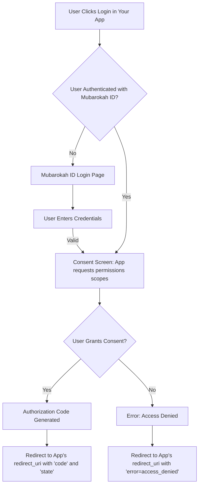

# OAuth 2.0 Flows

Mubarokah ID primarily uses the **OAuth 2.0 Authorization Code Grant** for third-party application authentication. This flow is designed for applications that can securely store a client secret. Additionally, a **Refresh Token Flow** is provided to obtain new access tokens without requiring user re-authentication.

## Authorization Code Grant (Recommended)

The Authorization Code Grant is the most common and secure OAuth 2.0 flow. It involves exchanging an authorization code for an access token.

```mermaid
stateDiagram-v2
    direction LR
    [*] --> InitiateAuth: Application Initiates
    InitiateAuth --> UserRedirected: Redirect user to /oauth/authorize
    UserRedirected --> UserAuthenticates: User logs in at Mubarokah ID
    UserAuthenticates --> ConsentScreen: User reviews requested permissions
    ConsentScreen --> CodeGenerated: User grants consent
    CodeGenerated --> AppReceivesCode: Mubarokah ID redirects to app with Auth Code
    AppReceivesCode --> TokenExchange: App exchanges Auth Code for Tokens (server-side)
    TokenExchange --> TokensValidated: Mubarokah ID issues Access & Refresh Tokens
    TokensValidated --> ApiAccess: App uses Access Token to call API
    ApiAccess --> [*]: User session established

    UserAuthenticates --> LoginPage: If not already logged in
    LoginPage --> UserAuthenticates: Login successful

    ConsentScreen --> AuthDenied: User denies consent
    AuthDenied --> [*]: Access Denied by User

    TokenExchange --> TokenError: Invalid code/client credentials
    TokenError --> [*]: Integration Error
```



### Detailed Step-by-Step Implementation

#### Step 1: Authorization Request (User Redirection)

Your application initiates the flow by redirecting the user's browser to Mubarokah ID's authorization endpoint.

```http
GET /oauth/authorize HTTP/1.1
Host: mubarokah.id
```

**Parameters:**

| Parameter             | Type   | Required | Description                                                                 |
|-----------------------|--------|----------|-----------------------------------------------------------------------------|
| `response_type`       | string | ✅        | Must be `code`.                                                             |
| `client_id`           | string | ✅        | Your application's unique Client ID.                                          |
| `redirect_uri`        | string | ✅        | The URL Mubarokah ID will redirect the user back to. Must match a registered URI. |
| `scope`               | string | ❌        | Space-separated list of permissions (e.g., `view-user detail-user`).        |
| `state`               | string | 🔸        | An opaque value used to prevent CSRF attacks. Highly recommended.           |
| `prompt`              | string | ❌        | Optional. Set to `consent` to force the consent screen even if already approved. |
| `code_challenge`      | string | ❌        | PKCE: The code challenge derived from the `code_verifier`. (Public clients)   |
| `code_challenge_method`| string | ❌        | PKCE: Usually `S256`. (Public clients)                                       |

**Example Redirect URL Construction (JavaScript):**
```javascript
function generateRandomString(length = 40) {
  const characters = 'ABCDEFGHIJKLMNOPQRSTUVWXYZabcdefghijklmnopqrstuvwxyz0123456789-._~';
  let result = '';
  const charactersLength = characters.length;
  for (let i = 0; i < length; i++) {
    result += characters.charAt(Math.floor(Math.random() * charactersLength));
  }
  return result;
}

const CLIENT_ID = "your_client_id";
const REDIRECT_URI = "https://yourapp.com/callback";

// Store state in session to verify later
const state = generateRandomString();
sessionStorage.setItem('oauth_state', state);

const authParams = {
  response_type: 'code',
  client_id: CLIENT_ID,
  redirect_uri: REDIRECT_URI,
  scope: 'view-user detail-user', // Request desired scopes
  state: state,
  // For PKCE (typically for mobile/SPA clients without a secure backend for token exchange)
  // code_challenge: 'generated_code_challenge',
  // code_challenge_method: 'S256'
};

const authorizationUrl = \`https://mubarokah.id/oauth/authorize?\${new URLSearchParams(authParams)}\`;
// Redirect the user
window.location.href = authorizationUrl;
```

#### Step 2: User Authentication & Consent

-   The user is prompted to log in to Mubarokah ID (if not already).
-   After successful login, Mubarokah ID displays a consent screen where the user can approve or deny the permissions (scopes) your application is requesting.



#### Step 3: Authorization Code Response (Redirection to Your App)

If the user grants consent, Mubarokah ID redirects the user back to your application's `redirect_uri` with an `authorization_code` and the `state` parameter.

**Example Success Redirect:**
```text
https://yourapp.com/callback?code=AUTHORIZATION_CODE_HERE&state=YOUR_ORIGINAL_STATE
```
<Info>Your application should first verify that the received `state` matches the one generated in Step 1 to prevent CSRF attacks.</Info>

**Example Error Redirect:**
If the user denies access or an error occurs:
```text
https://yourapp.com/callback?error=access_denied&error_description=The+user+denied+access+to+your+application.&state=YOUR_ORIGINAL_STATE
```

#### Step 4: Token Exchange (Server-to-Server)

<Warning>This step **must** be performed on your application's backend server, as it requires your `client_secret`.</Warning>

Your application exchanges the `authorization_code` for an `access_token` and a `refresh_token` by making a POST request to Mubarokah ID's token endpoint.

```http
POST /oauth/token HTTP/1.1
Host: mubarokah.id
Content-Type: application/x-www-form-urlencoded
Authorization: Basic base64(client_id:client_secret) // Only if not sending client_id/secret in body
```

**Request Body Parameters (`application/x-www-form-urlencoded`):**

| Parameter        | Type   | Required | Description                                                                     |
|------------------|--------|----------|---------------------------------------------------------------------------------|
| `grant_type`     | string | ✅        | Must be `authorization_code`.                                                   |
| `code`           | string | ✅        | The authorization code received in Step 3.                                      |
| `redirect_uri`   | string | ✅        | The same `redirect_uri` used in Step 1.                                         |
| `client_id`      | string | ✅        | Your application's Client ID. (Required if not using Basic Auth header)           |
| `client_secret`  | string | ✅        | Your application's Client Secret. (Required if not using Basic Auth header)       |
| `code_verifier`  | string | ❌        | PKCE: The original `code_verifier` if `code_challenge` was used. (Public clients) |


**Example Token Exchange (Node.js - Server-Side):**
```javascript
const fetch = require('node-fetch'); // Or your preferred HTTP client

const CLIENT_ID = "your_client_id";
const CLIENT_SECRET = "your_client_secret"; // Keep this secure on the server!
const REDIRECT_URI = "https://yourapp.com/callback";
const authorizationCode = "code_from_step_3";

async function exchangeCodeForTokens(code) {
  const params = new URLSearchParams();
  params.append('grant_type', 'authorization_code');
  params.append('code', code);
  params.append('redirect_uri', REDIRECT_URI);
  params.append('client_id', CLIENT_ID);
  params.append('client_secret', CLIENT_SECRET);
  // If using PKCE, also append:
  // params.append('code_verifier', stored_code_verifier);

  try {
    const response = await fetch('https://mubarokah.id/oauth/token', {
      method: 'POST',
      headers: {
        'Content-Type': 'application/x-www-form-urlencoded',
        // Alternative to sending client_id/secret in body:
        // 'Authorization': 'Basic ' + Buffer.from(CLIENT_ID + ':' + CLIENT_SECRET).toString('base64')
      },
      body: params
    });

    const tokenData = await response.json();

    if (!response.ok) {
      throw new Error(tokenData.error_description || tokenData.error || 'Token exchange failed');
    }

    // Successfully received tokens:
    // tokenData.access_token
    // tokenData.refresh_token
    // tokenData.expires_in (lifetime of access token in seconds)
    // tokenData.token_type (usually "Bearer")
    // tokenData.scope (granted scopes)
    console.log(tokenData);
    return tokenData;
  } catch (error) {
    console.error('Token Exchange Error:', error.message);
    // Handle error appropriately
    throw error;
  }
}

// exchangeCodeForTokens(authorizationCode);
```

**Successful Token Response (JSON):**
```json
{
  "token_type": "Bearer",
  "expires_in": 86400, // e.g., 24 hours
  "access_token": "eyJ0eXAiOiJKV1QiLCJhbGciOiJSUzI1NiJ9...",
  "refresh_token": "def502003e1b8f3c5f8b1a2d9e7f6c8d4e9b2a1c...",
  "scope": "view-user detail-user" // Granted scopes
}
```
Store the `access_token` and `refresh_token` securely, associating them with the user. The `access_token` is used to make API requests on behalf of the user.

## Refresh Token Flow

Access tokens are short-lived for security reasons. When an access token expires, your application can use a refresh token to obtain a new access token without requiring the user to go through the authorization flow again.

```http
POST /oauth/token HTTP/1.1
Host: mubarokah.id
Content-Type: application/x-www-form-urlencoded
```

**Request Body Parameters (`application/x-www-form-urlencoded`):**

| Parameter        | Type   | Required | Description                                                                 |
|------------------|--------|----------|-----------------------------------------------------------------------------|
| `grant_type`     | string | ✅        | Must be `refresh_token`.                                                    |
| `refresh_token`  | string | ✅        | The refresh token issued during the token exchange.                         |
| `client_id`      | string | ✅        | Your application's Client ID.                                               |
| `client_secret`  | string | ✅        | Your application's Client Secret.                                           |
| `scope`          | string | ❌        | Optional. Request a subset of the original scopes. If omitted, original scopes are granted. |

**Example Refresh Token Request (Node.js - Server-Side):**
```javascript
const fetch = require('node-fetch');

const CLIENT_ID = "your_client_id";
const CLIENT_SECRET = "your_client_secret";
const existingRefreshToken = "user_refresh_token_here";

async function refreshAccessToken(refreshToken) {
  const params = new URLSearchParams();
  params.append('grant_type', 'refresh_token');
  params.append('refresh_token', refreshToken);
  params.append('client_id', CLIENT_ID);
  params.append('client_secret', CLIENT_SECRET);
  // params.append('scope', 'view-user'); // Optionally narrow scopes

  try {
    const response = await fetch('https://mubarokah.id/oauth/token', {
      method: 'POST',
      headers: {
        'Content-Type': 'application/x-www-form-urlencoded',
      },
      body: params
    });

    const tokenData = await response.json();

    if (!response.ok) {
      throw new Error(tokenData.error_description || tokenData.error || 'Token refresh failed');
    }

    // Successfully received new tokens:
    // tokenData.access_token
    // tokenData.refresh_token (sometimes a new refresh token is issued)
    // tokenData.expires_in
    // tokenData.token_type
    console.log("New Tokens:", tokenData);
    // Securely store the new tokens, potentially replacing the old refresh token if a new one is provided.
    return tokenData;
  } catch (error) {
    console.error('Token Refresh Error:', error.message);
    // If refresh fails (e.g., refresh token revoked or invalid),
    // the user may need to re-authenticate.
    throw error;
  }
}

// refreshAccessToken(existingRefreshToken);
```
<Info>
  Refresh tokens can also expire or be revoked. If the refresh token flow fails, your application should direct the user to re-initiate the Authorization Code Grant flow.
</Info>

## Client Credentials Grant (Machine-to-Machine)

For server-to-server communication where no user is directly involved, the Client Credentials Grant can be used. This flow allows your application to obtain an access token to access its own resources or act on its own behalf.

```http
POST /oauth/token HTTP/1.1
Host: mubarokah.id
Content-Type: application/x-www-form-urlencoded
```

**Request Body Parameters (`application/x-www-form-urlencoded`):**

| Parameter        | Type   | Required | Description                                                                 |
|------------------|--------|----------|-----------------------------------------------------------------------------|
| `grant_type`     | string | ✅        | Must be `client_credentials`.                                               |
| `client_id`      | string | ✅        | Your application's Client ID.                                               |
| `client_secret`  | string | ✅        | Your application's Client Secret.                                           |
| `scope`          | string | ❌        | Optional. Space-separated list of scopes relevant to client operations.       |

**Example Client Credentials Request (Node.js - Server-Side):**
```javascript
const fetch = require('node-fetch');

const CLIENT_ID = "your_client_id";
const CLIENT_SECRET = "your_client_secret";

async function getAppToken() {
  const params = new URLSearchParams();
  params.append('grant_type', 'client_credentials');
  params.append('client_id', CLIENT_ID);
  params.append('client_secret', CLIENT_SECRET);
  // params.append('scope', 'some-client-specific-scope'); // Optional

  try {
    const response = await fetch('https://mubarokah.id/oauth/token', {
      method: 'POST',
      headers: {
        'Content-Type': 'application/x-www-form-urlencoded',
      },
      body: params
    });

    const tokenData = await response.json();

    if (!response.ok) {
      throw new Error(tokenData.error_description || tokenData.error || 'Client credentials grant failed');
    }

    // Successfully received app access token:
    // tokenData.access_token
    // tokenData.expires_in
    // tokenData.token_type
    // tokenData.scope
    console.log("App Access Token:", tokenData.access_token);
    return tokenData;
  } catch (error) {
    console.error('Client Credentials Error:', error.message);
    throw error;
  }
}

// getAppToken();
```
This flow typically does not return a refresh token. When the access token expires, your application must request a new one using the same Client Credentials Grant.
